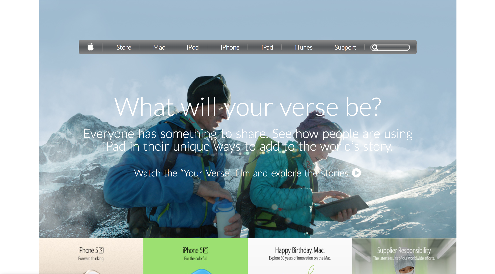

# apple.com-homepage-clone

> This project consists of building an HTML document that matches the appearance of the home page of apple.com archived website. It was developed as a requirement for Microverse HTML and CSS course.

Additional description about the project and its features.
In this Microverse project, I made use of float and flex CSS principles to make a clone of an archived Apple.com home page. Also, CSS background and gradient principles were implemented.

## Built With

- Html
- CSS

## Live Demo

[Live Demo Link](https://rawcdn.githack.com/krys2fa/apple.com-homepage-clone/1f3506f12a73a8735c50795f5a06aeea6153b982/index.html)

## Getting Started

**Click on the link above in order to see the Live Demo of the front end project.**

To get a local copy up and running follow these simple example steps.

### Prerequisites

- Web Browser
- Text Editor

### Setup

- Download repository files

## Authors

👤 **Author**

- Github: [@krys2fa](https://github.com/krys2fa)
- Twitter: [@krys2fa](https://twitter.com/krys2fa)
- Linkedin: [linkedin](https://www.linkedin.com/in/christopher-amanor-81a7b93b/)

## 🤝 Contributing

Contributions, issues and feature requests are welcome!

Feel free to check the [issues page](issues/).

## Show your support

Give a ⭐️ if you like this project!

## Acknowledgments

- Hat tip to anyone whose code was used
- Inspiration
- etc

## 📝 License

This project is [MIT](lic.url) licensed.

